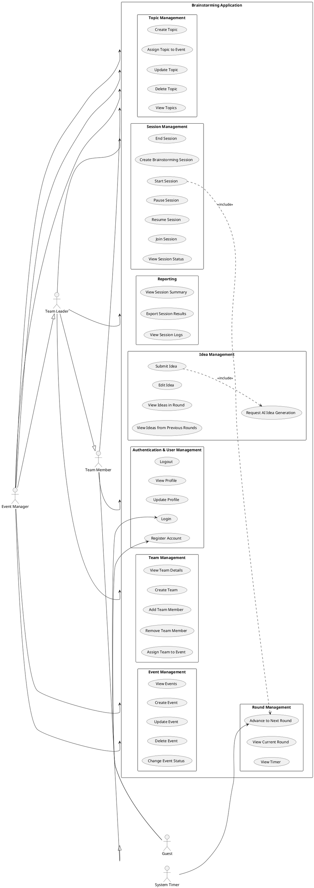

# Requirements Analysis Document
## Brainstorming Application with 6-3-5 Method

**Course:** CSE443 - Object-Oriented Analysis and Design
**Project Name:** Collaborative Brainstorming Platform
**Version:** 1.0
**Date:** November 2025
**Team Members:** [Your Team Names]

---

## Table of Contents

1. [Introduction](#1-introduction)
   - 1.1 Purpose
   - 1.2 Scope
   - 1.3 Definitions, Acronyms, and Abbreviations
   - 1.4 References
   - 1.5 Overview
2. [Current System](#2-current-system)
   - 2.1 Current State of Affairs
   - 2.2 Problems with Current System
   - 2.3 Limitations
3. [Proposed System](#3-proposed-system)
   - 3.1 System Overview
   - 3.2 Functional Requirements
   - 3.3 Non-Functional Requirements
   - 3.4 System Models
     - 3.4.1 Use Case Model
     - 3.4.2 Use Case Scenarios
     - 3.4.3 Domain Model (Class Diagram)
     - 3.4.4 Dynamic Models
     - 3.4.5 User Interface Mock-ups
4. [Glossary of Terms](#4-glossary-of-terms)
5. [Traceability Matrix](#5-traceability-matrix)
6. [Appendices](#6-appendices)

---

## 1. Introduction

### 1.1 Purpose

The Collaborative Brainstorming Platform is a web-based and mobile application designed to facilitate structured brainstorming sessions using the proven **6-3-5 Method**. This method enables six participants to generate three ideas each over five rounds, resulting in 90+ ideas in just 30 minutes.

The system aims to:
- **Digitize** the traditional paper-based 6-3-5 brainstorming method
- **Enable remote collaboration** for distributed teams
- **Provide AI-powered assistance** for idea generation and session insights
- **Track and document** brainstorming sessions with comprehensive audit trails
- **Facilitate event management** for multiple concurrent brainstorming activities

### 1.2 Scope

#### In Scope:
- User authentication and role-based access control (Event Manager, Team Leader, Team Member)
- Event creation and management for brainstorming activities
- Topic definition and assignment to events
- Team formation with up to 6 members per team
- Real-time brainstorming sessions implementing the 6-3-5 methodology
- Synchronized round-based idea submission (3 ideas per member per round, 5 rounds total)
- Timer-based round progression (5 minutes per round)
- ChatGPT integration for AI-powered idea generation and session summaries
- Real-time updates using WebSocket (SignalR) technology
- Session logging and audit trail
- Cross-platform support (Web and Mobile - Flutter)
- REST API for all operations

#### Out of Scope:
- Video conferencing features
- File attachment to ideas
- Voting or ranking system for ideas
- Integration with external project management tools (v1.0)
- Multi-language support (v1.0)
- Email notifications (v1.0)

### 1.3 Definitions, Acronyms, and Abbreviations

| Term | Definition |
|------|------------|
| 6-3-5 Method | A structured brainstorming technique where 6 participants develop 3 ideas in 5 rounds |
| Event | A planned brainstorming activity with a specific timeframe |
| Topic | A subject or problem statement for brainstorming |
| Session | An active brainstorming meeting following the 6-3-5 method |
| Round | A time-boxed period (5 minutes) within a session for idea generation |
| Idea | A creative suggestion or solution submitted during a round |
| Team | A group of up to 6 members participating in brainstorming sessions |
| AI Annotation | ChatGPT-generated feedback or enhancement to a submitted idea |
| Event Manager | User role with full system access for event creation and management |
| Team Leader | User role responsible for managing a specific team |
| Team Member | User role for active participants in brainstorming sessions |

### 1.4 References

1. Rohrbach, B. (1969). "Creative by rules – Method 635, a new technique for solving problems." *Absatzwirtschaft* 12: 73-76.
2. W3C Web Content Accessibility Guidelines (WCAG) 2.1
3. OpenAPI Specification 3.0
4. IEEE Std 830-1998 - IEEE Recommended Practice for Software Requirements Specifications
5. UML 2.5 Specification - Object Management Group (OMG)

### 1.5 Overview

This Requirements Analysis Document is organized into five main sections:

- **Section 2** describes the current state of brainstorming practices and their limitations
- **Section 3** presents the proposed system with detailed functional and non-functional requirements, accompanied by UML models
- **Section 4** provides a comprehensive glossary of domain-specific terms
- **Section 5** establishes traceability between requirements and use cases
- **Section 6** includes appendices with additional technical details

---

## 2. Current System

### 2.1 Current State of Affairs

Currently, organizations and teams conduct brainstorming sessions using traditional methods:

#### Physical Meetings:
- Teams gather in meeting rooms with whiteboards, sticky notes, or flip charts
- A facilitator manages the session timing and idea collection
- Ideas are manually recorded on paper or photographed after sessions
- Physical presence is required, limiting participation from remote team members

#### Digital Collaboration Tools:
- Generic tools like Miro, Mural, or shared documents are used
- No built-in support for structured methods like 6-3-5
- Manual tracking of rounds and timing
- Lack of enforcement for the 6-3-5 rules (3 ideas per round, 6 participants)
- Limited AI assistance for idea generation

#### Ad-hoc Solutions:
- Some organizations use spreadsheets or custom scripts
- No centralized system for managing multiple events or teams
- Difficulty in tracking historical sessions and outcomes
- No audit trail or session analytics

### 2.2 Problems with Current System

1. **Lack of Structure**: Generic tools don't enforce the 6-3-5 methodology, leading to inconsistent execution
2. **Manual Overhead**: Facilitators must manually track time, count ideas, and manage round transitions
3. **Limited Remote Support**: Physical methods exclude remote participants; digital tools lack real-time synchronization
4. **No Historical Tracking**: Past sessions are difficult to review, compare, or analyze
5. **Scalability Issues**: Managing multiple concurrent brainstorming events is challenging
6. **Missing AI Assistance**: No intelligent support for idea generation or session insights
7. **Accessibility**: Physical methods exclude team members with mobility constraints
8. **Data Loss Risk**: Paper-based sessions can be lost; photos of whiteboards are difficult to search

### 2.3 Limitations

- **Time Zone Challenges**: Difficult to coordinate global teams
- **Participation Barriers**: Introverted members may not contribute equally in face-to-face settings
- **No Real-time Validation**: Facilitators can't enforce the "3 ideas per round" rule effectively
- **Lack of Analytics**: No insights into idea generation patterns or team performance
- **Resource Intensive**: Requires dedicated meeting rooms and facilitation time

---

## 3. Proposed System

### 3.1 System Overview

The Collaborative Brainstorming Platform addresses the limitations of current systems by providing a comprehensive, structured, and AI-enhanced solution for conducting brainstorming sessions using the 6-3-5 method.

#### Key Features:
- **Structured Workflow**: Enforces 6-3-5 rules automatically (6 members, 3 ideas, 5 rounds)
- **Real-time Collaboration**: WebSocket-based synchronization for all participants
- **AI Integration**: ChatGPT-powered idea generation and session summaries
- **Multi-platform**: Web (React) and Mobile (Flutter) applications
- **Role-based Access**: Three distinct roles with appropriate permissions
- **Comprehensive Audit**: Complete logging of all actions and session history

#### System Architecture:
- **Backend**: .NET 8 RESTful API with SignalR for real-time features
- **Frontend**: React 18 with TypeScript for web interface
- **Mobile**: Flutter for cross-platform mobile app
- **Database**: PostgreSQL for persistent storage
- **AI Service**: OpenAI GPT-4 integration
- **Authentication**: JWT-based authentication with BCrypt password hashing

---

### 3.2 Functional Requirements

#### 3.2.1 User Management

**FR-1**: The system shall allow users to register with email, password, first name, last name, phone number (optional), and role (Event Manager, Team Leader, or Team Member).

**FR-2**: The system shall validate that email addresses are unique and properly formatted during registration.

**FR-3**: The system shall hash passwords using BCrypt before storing them in the database.

**FR-4**: The system shall allow registered users to log in using their email and password.

**FR-5**: The system shall generate a JWT token upon successful login with a 24-hour expiration time.

**FR-6**: The system shall validate JWT tokens for all protected API endpoints.

**FR-7**: The system shall allow users to view their own profile information.

**FR-8**: The system shall allow users to update their profile information (first name, last name, phone number).

**FR-9**: The system shall prevent users from changing their email address after registration.

**FR-10**: The system shall enforce role-based access control for all system operations.

#### 3.2.2 Event Management

**FR-11**: The system shall allow Event Managers to create new events with name, description, start date, and end date.

**FR-12**: The system shall validate that the end date is after the start date for all events.

**FR-13**: The system shall automatically set the event status to "Planned" upon creation.

**FR-14**: The system shall allow Event Managers to update event details (name, description, dates).

**FR-15**: The system shall allow Event Managers to change event status (Planned, Active, Completed, Cancelled).

**FR-16**: The system shall allow Event Managers to delete events that have no associated sessions.

**FR-17**: The system shall allow all authenticated users to view a list of all events.

**FR-18**: The system shall allow users to filter events by status.

**FR-19**: The system shall display event details including name, description, dates, status, and creator information.

**FR-20**: The system shall prevent deletion of events that have associated brainstorming sessions.

#### 3.2.3 Topic Management

**FR-21**: The system shall allow Event Managers to create topics with title and description.

**FR-22**: The system shall allow Event Managers to assign topics to specific events.

**FR-23**: The system shall allow Event Managers to update topic information.

**FR-24**: The system shall allow Event Managers to change topic status (Open, Closed, Archived).

**FR-25**: The system shall allow all authenticated users to view topics associated with events they have access to.

**FR-26**: The system shall allow Event Managers to delete topics that are not assigned to any sessions.

**FR-27**: The system shall display all topics associated with a specific event.

#### 3.2.4 Team Management

**FR-28**: The system shall allow Team Leaders to create teams with name, description, and maximum members (default 6).

**FR-29**: The system shall enforce a maximum of 6 members per team for 6-3-5 methodology compliance.

**FR-30**: The system shall allow Team Leaders to assign a team leader to each team.

**FR-31**: The system shall allow Team Leaders to add members to their teams.

**FR-32**: The system shall validate that a member can only be added if the team has not reached maximum capacity.

**FR-33**: The system shall allow Team Leaders to remove members from their teams.

**FR-34**: The system shall prevent removal of team members if they have active sessions.

**FR-35**: The system shall allow Team Leaders to view all members of their teams.

**FR-36**: The system shall display team information including name, description, leader, and member count.

**FR-37**: The system shall allow Event Managers to assign teams to events.

#### 3.2.5 Event Participation

**FR-38**: The system shall allow Event Managers to add participants to events.

**FR-39**: The system shall allow Event Managers to remove participants from events.

**FR-40**: The system shall send notifications to users when they are added to an event.

**FR-41**: The system shall allow users to view all events they are participating in.

**FR-42**: The system shall display participant lists for each event.

**FR-43**: The system shall prevent duplicate participation records for the same user and event.

#### 3.2.6 Brainstorming Session Management

**FR-44**: The system shall allow Team Leaders to create brainstorming sessions by selecting a team and topic.

**FR-45**: The system shall validate that the selected team has at least 3 members before creating a session.

**FR-46**: The system shall initialize sessions with status "NotStarted" and round number 0.

**FR-47**: The system shall set total rounds to 5 and round duration to 5 minutes for all sessions.

**FR-48**: The system shall allow Team Leaders to start a session, changing status to "InProgress".

**FR-49**: The system shall automatically create the first round when a session is started.

**FR-50**: The system shall start a countdown timer when a round begins.

**FR-51**: The system shall broadcast the timer countdown to all session participants in real-time.

**FR-52**: The system shall allow Team Leaders to pause an active session.

**FR-53**: The system shall allow Team Leaders to resume a paused session.

**FR-54**: The system shall automatically advance to the next round when the timer expires.

**FR-55**: The system shall validate that all team members have submitted exactly 3 ideas before allowing manual round advancement.

**FR-56**: The system shall mark a session as "Completed" after 5 rounds are finished.

**FR-57**: The system shall allow Team Leaders to manually end a session at any time.

**FR-58**: The system shall prevent starting new rounds if the session has reached 5 rounds.

**FR-59**: The system shall display session information including team, topic, status, current round, and elapsed time.

**FR-60**: The system shall allow participants to view the session they are currently in.

#### 3.2.7 Round Management

**FR-61**: The system shall automatically create a new round when the previous round completes.

**FR-62**: The system shall assign a sequential round number (1 to 5) to each round.

**FR-63**: The system shall record the start time when a round begins.

**FR-64**: The system shall record the end time when a round completes.

**FR-65**: The system shall display the current round number to all participants.

**FR-66**: The system shall show elapsed time and remaining time for the current round.

**FR-67**: The system shall prevent idea submission after a round has ended.

#### 3.2.8 Idea Management

**FR-68**: The system shall allow team members to submit ideas during an active round.

**FR-69**: The system shall validate that each user submits exactly 3 ideas per round.

**FR-70**: The system shall prevent users from submitting more than 3 ideas in a single round.

**FR-71**: The system shall prevent users from submitting ideas if they are not part of the session's team.

**FR-72**: The system shall assign a sequential order (1, 2, 3) to each idea within a round.

**FR-73**: The system shall record the submission timestamp for each idea.

**FR-74**: The system shall mark ideas as "AI-generated: false" by default for user-submitted ideas.

**FR-75**: The system shall allow users to edit their ideas before the round ends.

**FR-76**: The system shall prevent editing of ideas after the round has ended.

**FR-77**: The system shall broadcast newly submitted ideas to all session participants in real-time.

**FR-78**: The system shall display all ideas submitted in the current round to all participants.

**FR-79**: The system shall allow users to view ideas from previous rounds in the same session.

**FR-80**: The system shall display the author's name for each idea.

**FR-81**: The system shall show the round number and order for each idea.

#### 3.2.9 ChatGPT Integration

**FR-82**: The system shall provide an option to generate AI-powered ideas during a round.

**FR-83**: The system shall call the OpenAI GPT-4 API with the topic description to generate ideas.

**FR-84**: The system shall allow users to request AI-generated ideas when they have not reached the 3-idea limit.

**FR-85**: The system shall mark AI-generated ideas with "AI-generated: true".

**FR-86**: The system shall allow users to edit AI-generated ideas before submitting them.

**FR-87**: The system shall log all ChatGPT API calls including prompt, response, and token usage.

**FR-88**: The system shall provide AI-powered session summaries after a session completes.

**FR-89**: The system shall generate AI annotations for ideas suggesting improvements or related concepts.

**FR-90**: The system shall display AI annotations alongside the original ideas.

**FR-91**: The system shall rate-limit ChatGPT API calls to prevent abuse (max 10 calls per user per session).

#### 3.2.10 Real-time Communication (SignalR)

**FR-92**: The system shall establish WebSocket connections for all active session participants.

**FR-93**: The system shall broadcast "RoundStarted" events when a new round begins.

**FR-94**: The system shall broadcast "RoundEnded" events when a round completes.

**FR-95**: The system shall broadcast "IdeaSubmitted" events when a participant submits an idea.

**FR-96**: The system shall broadcast "SessionStatusChanged" events when session status updates.

**FR-97**: The system shall broadcast "ParticipantJoined" events when a user joins a session.

**FR-98**: The system shall broadcast "ParticipantLeft" events when a user leaves a session.

**FR-99**: The system shall send "TimerUpdate" events every second during active rounds.

**FR-100**: The system shall send "Notification" events for important system messages.

**FR-101**: The system shall automatically reconnect WebSocket connections if they drop.

**FR-102**: The system shall maintain session state for reconnecting clients.

#### 3.2.11 Session Logging and Audit Trail

**FR-103**: The system shall log all session-related actions (start, pause, resume, end).

**FR-104**: The system shall log all round transitions with timestamps.

**FR-105**: The system shall log all idea submissions with user and timestamp information.

**FR-106**: The system shall log all ChatGPT interactions with prompts and responses.

**FR-107**: The system shall record the user who performed each logged action.

**FR-108**: The system shall allow Event Managers and Team Leaders to view session logs.

**FR-109**: The system shall provide filtering options for logs (by session, by user, by date range).

**FR-110**: The system shall export session logs in JSON format.

**FR-111**: The system shall retain session logs for a minimum of 1 year.

#### 3.2.12 Reporting and Analytics

**FR-112**: The system shall display the total number of ideas generated per session.

**FR-113**: The system shall calculate and display the average ideas per participant.

**FR-114**: The system shall show the distribution of ideas across rounds.

**FR-115**: The system shall identify the most active participants (by idea count).

**FR-116**: The system shall display session duration and time spent per round.

**FR-117**: The system shall show the percentage of AI-generated ideas vs. user-generated ideas.

**FR-118**: The system shall allow exporting session results to PDF or Excel format.

---

### 3.3 Non-Functional Requirements

#### 3.3.1 Performance

**NFR-1**: The system shall support at least 100 concurrent brainstorming sessions.

**NFR-2**: The system shall handle at least 600 concurrent WebSocket connections (100 sessions × 6 users).

**NFR-3**: The system shall respond to REST API requests within 500ms under normal load.

**NFR-4**: The system shall broadcast real-time events to all session participants within 100ms.

**NFR-5**: The system shall process and store an idea submission within 200ms.

**NFR-6**: The ChatGPT API integration shall timeout after 10 seconds if no response is received.

#### 3.3.2 Scalability

**NFR-7**: The system architecture shall support horizontal scaling of the API server.

**NFR-8**: The system shall use stateless authentication (JWT) to enable load balancing.

**NFR-9**: The database schema shall support millions of ideas without performance degradation.

**NFR-10**: The system shall implement database indexing on frequently queried fields (user email, session ID, round ID).

#### 3.3.3 Reliability and Availability

**NFR-11**: The system shall have an uptime of 99.5% (excluding planned maintenance).

**NFR-12**: The system shall gracefully handle WebSocket connection failures with automatic reconnection.

**NFR-13**: The system shall persist session state to the database every 30 seconds to prevent data loss.

**NFR-14**: The system shall implement database backups every 24 hours with 30-day retention.

**NFR-15**: The system shall log all errors with stack traces for debugging purposes.

#### 3.3.4 Security

**NFR-16**: The system shall use HTTPS for all client-server communication.

**NFR-17**: The system shall use WSS (WebSocket Secure) for real-time connections.

**NFR-18**: The system shall hash passwords using BCrypt with a work factor of 10 or higher.

**NFR-19**: The system shall implement JWT token expiration (24 hours).

**NFR-20**: The system shall validate and sanitize all user inputs to prevent SQL injection.

**NFR-21**: The system shall implement CORS (Cross-Origin Resource Sharing) restrictions.

**NFR-22**: The system shall protect API endpoints with role-based authorization checks.

**NFR-23**: The system shall rate-limit API requests to prevent denial-of-service attacks (100 requests per minute per user).

**NFR-24**: The system shall store ChatGPT API keys securely using environment variables or secret management.

#### 3.3.5 Usability

**NFR-25**: The web interface shall be responsive and work on desktop, tablet, and mobile browsers.

**NFR-26**: The system shall provide visual feedback for all user actions within 100ms.

**NFR-27**: The system shall display error messages in a user-friendly format.

**NFR-28**: The timer display shall be prominently visible during active rounds.

**NFR-29**: The system shall provide keyboard shortcuts for common actions (submit idea: Ctrl+Enter).

**NFR-30**: The system shall follow WCAG 2.1 Level AA accessibility guidelines.

#### 3.3.6 Maintainability

**NFR-31**: The system shall follow Clean Architecture principles with clear separation of concerns.

**NFR-32**: The backend code shall achieve at least 70% unit test coverage.

**NFR-33**: The system shall use a consistent coding style enforced by linters (ESLint, Prettier for frontend; StyleCop for backend).

**NFR-34**: The system shall provide comprehensive API documentation using Swagger/OpenAPI.

**NFR-35**: The system shall use semantic versioning for all releases.

#### 3.3.7 Compatibility

**NFR-36**: The web application shall support the latest versions of Chrome, Firefox, Safari, and Edge.

**NFR-37**: The web application shall support browsers released within the last 2 years.

**NFR-38**: The mobile application shall support iOS 13+ and Android 8.0+.

**NFR-39**: The system shall use standard protocols (HTTP/HTTPS, WebSocket/WSS) for interoperability.

#### 3.3.8 Data Integrity

**NFR-40**: The system shall enforce foreign key constraints in the database.

**NFR-41**: The system shall use database transactions for multi-step operations.

**NFR-42**: The system shall validate data types and ranges before database insertion.

**NFR-43**: The system shall implement soft deletes for critical entities (users, events, sessions).

**NFR-44**: The system shall maintain audit timestamps (created_at, updated_at) for all entities.

#### 3.3.9 Localization (Future)

**NFR-45**: The system architecture shall support future internationalization (i18n).

**NFR-46**: The system shall store all timestamps in UTC format.

**NFR-47**: The system shall display dates and times in the user's local timezone.

---

### 3.4 System Models

#### 3.4.1 Use Case Model

See [Use Case Diagram (PlantUML)](#use-case-diagram) for visual representation.

**Actors:**

1. **Guest** - Unauthenticated user
2. **Team Member** - Authenticated user who participates in brainstorming sessions
3. **Team Leader** - Team Member with additional permissions to manage teams and sessions
4. **Event Manager** - Privileged user who can create events, topics, and manage all system entities
5. **System Timer** - Automated actor that triggers round transitions

**Use Cases:**

**Authentication and User Management:**
- UC-01: Register Account
- UC-02: Login
- UC-03: View Profile
- UC-04: Update Profile
- UC-05: Logout

**Event Management:**
- UC-06: Create Event (Event Manager)
- UC-07: View Events (All Users)
- UC-08: Update Event (Event Manager)
- UC-09: Delete Event (Event Manager)
- UC-10: Change Event Status (Event Manager)

**Topic Management:**
- UC-11: Create Topic (Event Manager)
- UC-12: Assign Topic to Event (Event Manager)
- UC-13: View Topics (All Users)
- UC-14: Update Topic (Event Manager)
- UC-15: Delete Topic (Event Manager)

**Team Management:**
- UC-16: Create Team (Team Leader)
- UC-17: Add Team Member (Team Leader)
- UC-18: Remove Team Member (Team Leader)
- UC-19: View Team Details (Team Members)
- UC-20: Assign Team to Event (Event Manager)

**Session Management:**
- UC-21: Create Brainstorming Session (Team Leader)
- UC-22: Join Session (Team Member)
- UC-23: Start Session (Team Leader)
- UC-24: Pause Session (Team Leader)
- UC-25: Resume Session (Team Leader)
- UC-26: End Session (Team Leader)
- UC-27: View Session Status (Team Member)

**Idea Management:**
- UC-28: Submit Idea (Team Member)
- UC-29: Edit Idea (Team Member)
- UC-30: View Ideas in Round (Team Member)
- UC-31: View Ideas from Previous Rounds (Team Member)
- UC-32: Request AI Idea Generation (Team Member)

**Round Management:**
- UC-33: Advance to Next Round (System Timer / Team Leader)
- UC-34: View Current Round (Team Member)
- UC-35: View Timer (Team Member)

**Reporting:**
- UC-36: View Session Summary (Team Leader, Event Manager)
- UC-37: Export Session Results (Team Leader, Event Manager)
- UC-38: View Session Logs (Team Leader, Event Manager)

---

#### Use Case Diagram

---
