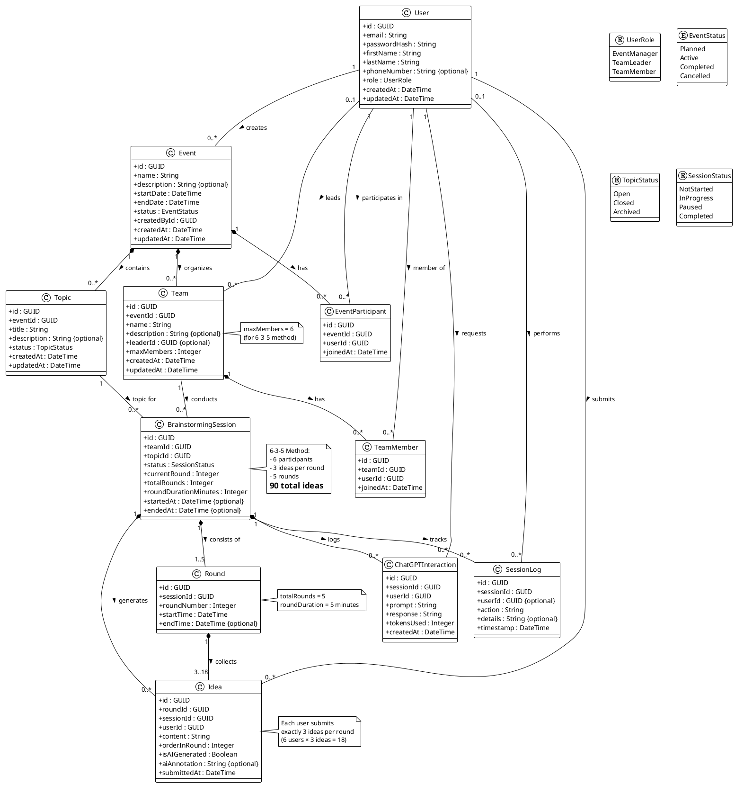
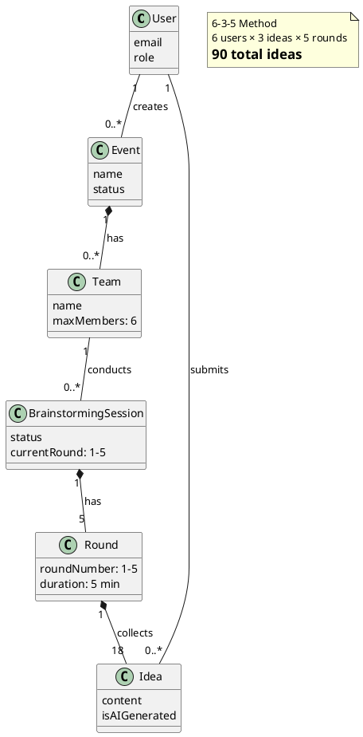

# Domain Model (Conceptual Class Diagram)

## Overview

This domain model represents the conceptual structure of the Brainstorming Application at the analysis level. It shows entities, their attributes, and relationships without implementation details (no methods, no database-specific elements).

---

## Class Diagram (PlantUML)

---

## Entity Descriptions

### User
Represents a registered user of the system. Users have one of three roles determining their permissions.

**Key Constraints:**
- Email must be unique
- Password must be hashed (BCrypt)
- Role determines system access level

**Relationships:**
- Creates Events (Event Manager)
- Participates in Events through EventParticipant
- Belongs to Teams through TeamMember
- May lead multiple Teams
- Submits Ideas during sessions
- Requests ChatGPT assistance

---

### Event
Represents a planned or ongoing brainstorming event that may contain multiple topics and teams.

**Key Constraints:**
- Start date must be before end date
- Status transitions: Planned → Active → Completed/Cancelled
- Can only be deleted if no sessions exist

**Relationships:**
- Created by one User (Event Manager)
- Contains multiple Topics
- Has multiple Participants (EventParticipant)
- Organizes multiple Teams

---

### Topic
Represents a subject or problem statement for brainstorming sessions.

**Key Constraints:**
- Must be assigned to exactly one Event
- Title is required, description is optional
- Status affects availability for new sessions

**Relationships:**
- Belongs to one Event
- Used in multiple BrainstormingSessions

---

### EventParticipant
Association entity linking Users to Events they are participating in.

**Key Constraints:**
- Unique combination of userId and eventId (no duplicate participations)
- Automatically created when user is added to event

**Relationships:**
- Links one User to one Event

---

### Team
Represents a group of users who will conduct brainstorming sessions together.

**Key Constraints:**
- Maximum 6 members (enforced by 6-3-5 methodology)
- Minimum 3 members required to start session
- Must be assigned to exactly one Event
- Leader must be a TeamMember of this team

**Relationships:**
- Belongs to one Event
- Has multiple TeamMembers (3-6)
- Led by one User (optional initially)
- Conducts multiple BrainstormingSessions

---

### TeamMember
Association entity linking Users to Teams.

**Key Constraints:**
- Unique combination of userId and teamId
- Team cannot exceed maxMembers (6)
- Cannot be removed if user has active sessions

**Relationships:**
- Links one User to one Team

---

### BrainstormingSession
Represents an active or completed brainstorming session following the 6-3-5 method.

**Key Constraints:**
- Must have exactly one Team and one Topic
- totalRounds always = 5
- roundDurationMinutes always = 5
- currentRound ranges from 0 (not started) to 5 (completed)
- Status progression: NotStarted → InProgress → Completed
- Can be Paused and Resumed

**Relationships:**
- Conducted by one Team
- Addresses one Topic
- Consists of 1-5 Rounds (progressive creation)
- Generates multiple Ideas (up to 90)
- Logs ChatGPT interactions
- Tracked by SessionLogs

**Business Rules:**
- Session starts with Round 1 creation
- Each round lasts 5 minutes
- Automatic advancement after timer expires
- Manual advancement allowed by Team Leader
- Session ends after Round 5 completes

---

### Round
Represents a 5-minute time-boxed period within a session for idea generation.

**Key Constraints:**
- roundNumber ranges from 1 to 5
- Must belong to exactly one Session
- startTime is required, endTime set when round completes
- Exactly 3 ideas per participant expected

**Relationships:**
- Belongs to one BrainstormingSession
- Collects 3-18 Ideas (3 per active participant)

**Business Rules:**
- Ideas can only be submitted while round is active
- Round completes when timer expires or leader advances
- Cannot edit ideas after round ends

---

### Idea
Represents a single creative suggestion submitted during a round.

**Key Constraints:**
- Content maximum 500 characters
- orderInRound: 1, 2, or 3 (submission order for user)
- isAIGenerated: tracks if generated by ChatGPT
- Must belong to both a Round and a Session (for faster queries)

**Relationships:**
- Submitted by one User
- Belongs to one Round
- Part of one BrainstormingSession

**Business Rules:**
- Each user submits exactly 3 ideas per round
- User-generated ideas: isAIGenerated = false
- AI-generated ideas can have aiAnnotation
- Cannot be deleted, only edited before round ends

---

### ChatGPTInteraction
Logs all interactions with the OpenAI GPT-4 API for audit and billing.

**Key Constraints:**
- prompt and response stored as text
- tokensUsed for cost tracking
- Immutable once created

**Relationships:**
- Requested by one User
- Associated with one BrainstormingSession

**Business Rules:**
- Maximum 10 requests per user per session
- Each request generates at most one idea
- Timeout after 10 seconds

---

### SessionLog
Audit trail for all actions performed during a session.

**Key Constraints:**
- action: enum or string (e.g., "SESSION_STARTED", "ROUND_ADVANCED", "IDEA_SUBMITTED")
- details: JSON or string with additional context
- userId optional for system-initiated actions

**Relationships:**
- Tracks actions in one BrainstormingSession
- Performed by zero or one User (null for system actions)

**Business Rules:**
- Automatically logged by system
- Immutable (no updates or deletes)
- Retained for minimum 1 year

---

## Key Multiplicities Explained

### 6-3-5 Method Constraints

1. **6 Participants:**
   - Team has 3-6 TeamMembers (minimum 3 to start)
   - Optimal: exactly 6 members

2. **3 Ideas per Round:**
   - Each User submits exactly 3 Ideas per Round
   - Round collects 3 × [number of participants] Ideas
   - With 6 participants: 18 Ideas per Round

3. **5 Rounds:**
   - BrainstormingSession has exactly 5 Rounds (created progressively)
   - Total: 5 Rounds × 18 Ideas = 90 Ideas per complete session

### Other Important Multiplicities

- **Event** `1 —> 0..*` **Topic**: One event can have multiple topics
- **Event** `1 —> 0..*` **Team**: One event can have multiple teams
- **Team** `1 —> 0..*` **BrainstormingSession**: One team can conduct multiple sessions
- **Topic** `1 —> 0..*` **BrainstormingSession**: One topic can be used in multiple sessions
- **User** `1 —> 0..*` **Idea**: One user submits many ideas across sessions

---

## Enumerations

### UserRole
Defines the three access levels in the system:

- **EventManager**: Full system access - creates events, topics, teams, manages all entities
- **TeamLeader**: Manages specific teams, creates/controls sessions
- **TeamMember**: Participates in sessions, submits ideas

### EventStatus
Tracks the lifecycle of an event:

- **Planned**: Event created but not yet started
- **Active**: Event is currently ongoing
- **Completed**: Event has finished
- **Cancelled**: Event was cancelled before completion

### TopicStatus
Indicates availability of topics:

- **Open**: Available for new sessions
- **Closed**: No longer accepting new sessions
- **Archived**: Retained for history but hidden from active lists

### SessionStatus
Tracks the state of a brainstorming session:

- **NotStarted**: Session created but not yet begun
- **InProgress**: Session actively running
- **Paused**: Session temporarily halted
- **Completed**: All 5 rounds finished

---

## Design Patterns Identified

### 1. Association Class Pattern
- **EventParticipant**: Links User and Event with additional data (joinedAt)
- **TeamMember**: Links User and Team with join timestamp

### 2. Composite Pattern
- **BrainstormingSession** composed of **Rounds**
- **Event** composed of **Topics** and **Teams**

### 3. State Pattern Opportunity
- **SessionStatus** suggests state machine for session lifecycle
- **Round** progression follows state transitions

### 4. Observer Pattern Opportunity
- Real-time updates (SignalR) for session events
- Participants observe session state changes

### 5. Strategy Pattern Opportunity
- Different AI generation strategies
- Different export formats (PDF, Excel, JSON)

---

## Constraints and Business Rules Summary

1. **Team Size**: 3 ≤ members ≤ 6
2. **Ideas per Round**: Exactly 3 per user
3. **Total Rounds**: Always 5
4. **Round Duration**: Always 5 minutes
5. **AI Requests**: Maximum 10 per user per session
6. **Idea Content**: Maximum 500 characters
7. **Email Uniqueness**: Each user must have unique email
8. **Event Dates**: startDate < endDate
9. **Session Status Flow**: NotStarted → InProgress → Completed (with optional Paused state)
10. **Round Completion**: Timer expiry OR manual advance by Team Leader

---

## Notes for Implementation Phase

**This is a CONCEPTUAL model - NOT a database or code design.**

When moving to design/implementation:
- Add methods to classes (business logic)
- Add navigation properties for Entity Framework
- Add validation attributes
- Define database indexes
- Implement DTOs for API responses
- Add service classes for business logic
- Implement repository pattern
- Add unit of work for transactions

**Current Level: Analysis**
**Next Level: Design (adding technical details)**

---

## Alternative Class Diagram View (Simplified)

For presentations or high-level discussions, here's a simplified view focusing on core entities:

---

## Traceability to Requirements

This domain model supports the following functional requirements:

- **FR-1 to FR-10**: User entity with authentication attributes
- **FR-11 to FR-20**: Event entity with CRUD operations
- **FR-21 to FR-27**: Topic entity and Event-Topic relationship
- **FR-28 to FR-37**: Team entity with member management
- **FR-38 to FR-43**: EventParticipant association
- **FR-44 to FR-60**: BrainstormingSession entity with 6-3-5 constraints
- **FR-61 to FR-67**: Round entity with timer and progression
- **FR-68 to FR-81**: Idea entity with submission rules
- **FR-82 to FR-91**: ChatGPTInteraction logging
- **FR-103 to FR-111**: SessionLog audit trail

---

**Document Version:** 1.0
**Last Updated:** November 2025
**Maintained By:** Development Team
