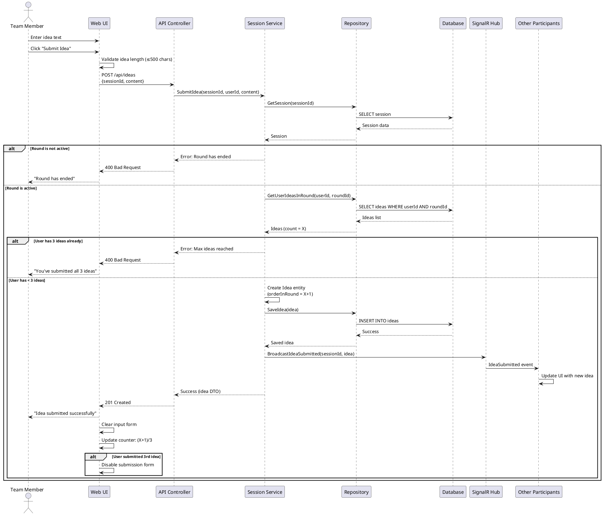
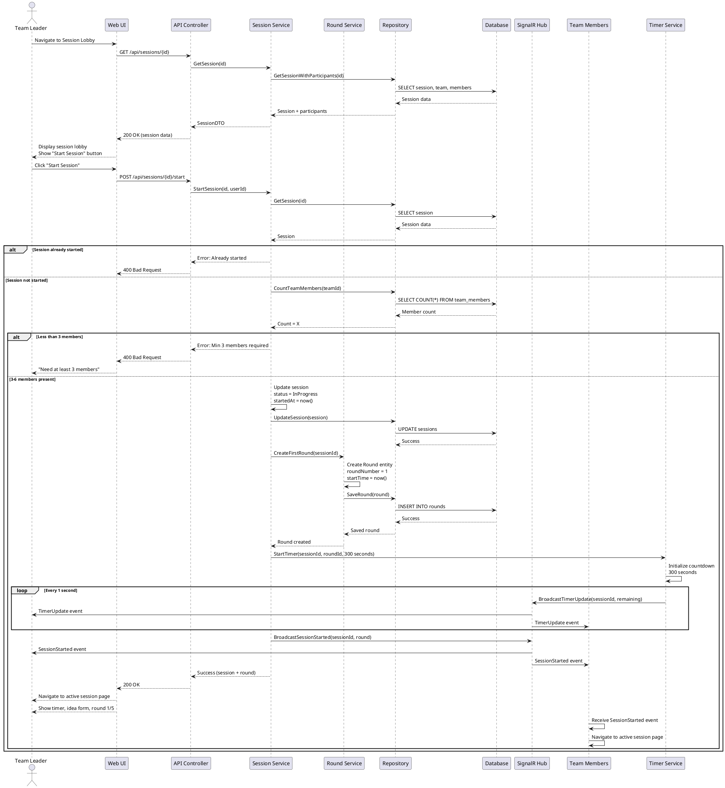
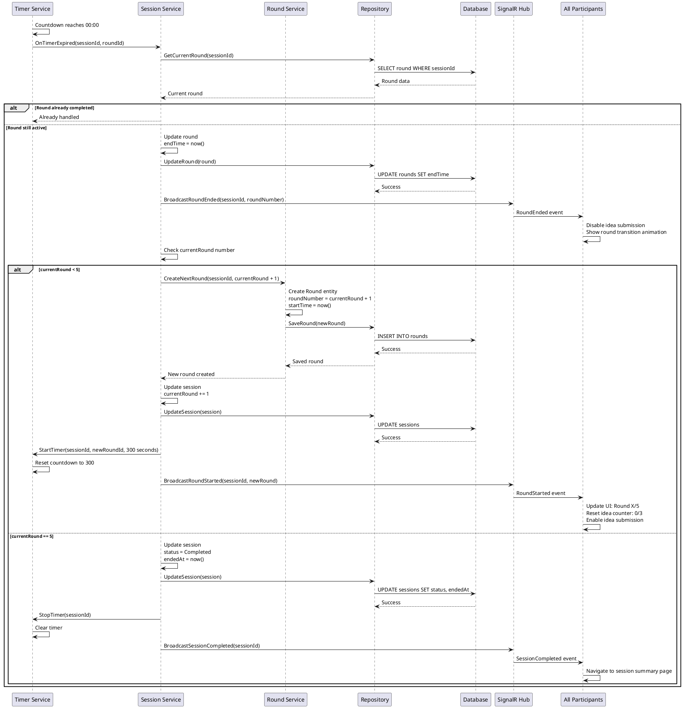
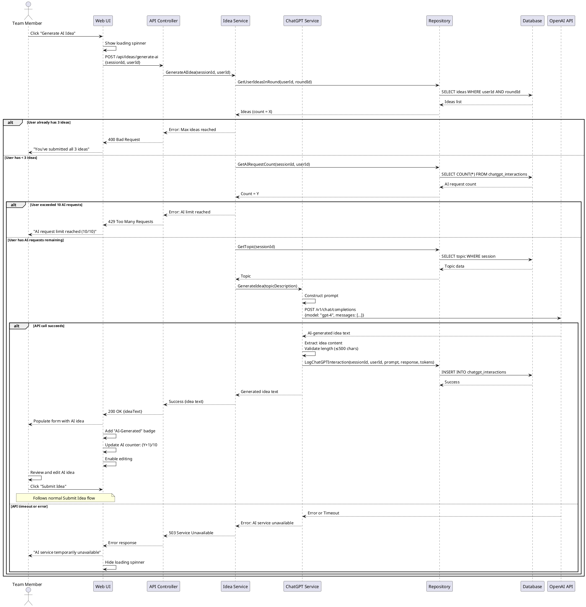
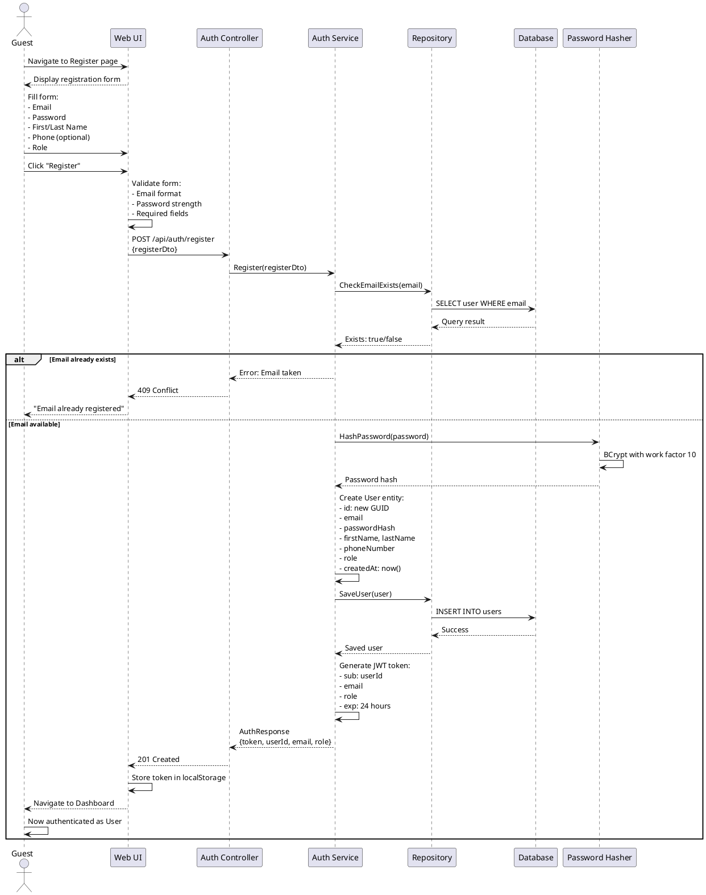
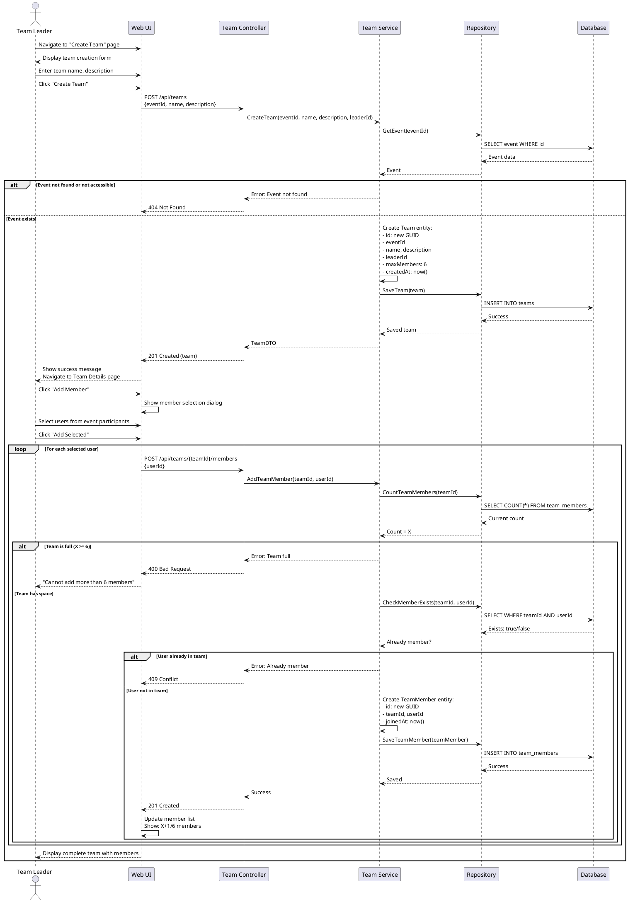

# Sequence Diagrams
## Dynamic Models for Key Scenarios

---

## 1. Sequence Diagram: Submit Idea During Active Session

---

## 2. Sequence Diagram: Start Brainstorming Session

---

## 3. Sequence Diagram: Automatic Round Advance (Timer Expiration)

---

## 4. Sequence Diagram: Request AI Idea Generation

---

## 5. Sequence Diagram: User Registration

---

## 6. Sequence Diagram: Create Team and Add Members

---

## Notes on Sequence Diagrams

### Purpose
These sequence diagrams illustrate the **dynamic behavior** of the system - how objects interact over time to accomplish use cases.

### Key Elements
- **Actors**: Users or external systems initiating actions
- **Participants**: System components (UI, controllers, services, repositories)
- **Messages**: Method calls or API requests
- **Activation Bars**: Duration of processing
- **alt/loop frames**: Conditional and repetitive flows
- **Return messages**: Responses (shown with dashed arrows)

### Implementation Notes
1. Error handling is shown with `alt` frames
2. Database transactions should wrap multi-step operations
3. SignalR broadcasts are asynchronous (fire-and-forget)
4. Timer service runs as a background service
5. All timestamps should be stored in UTC

### Additional Scenarios (Not Diagrammed)

For brevity, the following scenarios follow similar patterns:

- **Login**: Similar to Registration but uses password verification
- **Create Event**: Simple CRUD operation with validation
- **Pause/Resume Session**: Updates session status and timer state
- **View Session Summary**: Aggregates data from multiple tables
- **Manual Round Advance**: Similar to automatic but initiated by Team Leader

---

**Document Version:** 1.0
**Last Updated:** November 2025
